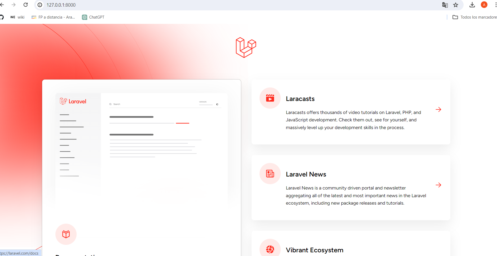
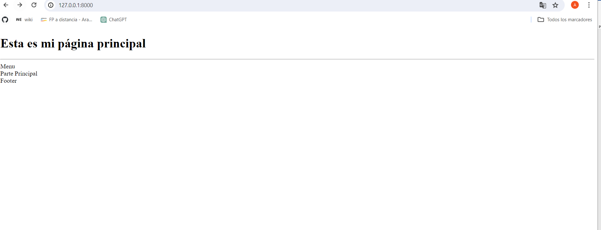
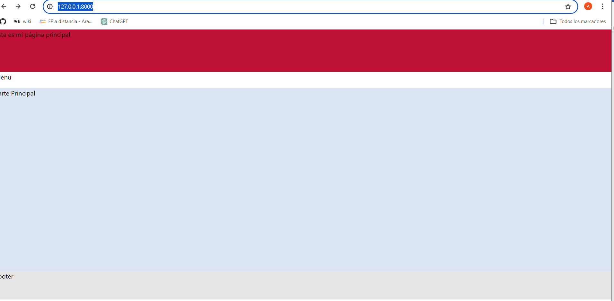

# Proyecto_Laravel
Práctica de Laravel

## Pasos previos
- Instalar composer y laravel: [Descargar Composer](https://getcomposer.org/Composer-Setup.exe)
- Desde MSDOS o PowerShell con privilegios de administrador, ejecutar el siguiente comando: `composer global require laravel/installer`
- Preparar el IDE, en este caso PhpStorm, e instalar los siguientes plugins útiles desde `Settings -> Plugins`:
    - Atom Material Icons
    - Laravel Idea

### Crear el proyecto
- Crear el proyecto Laravel: `composer create-project laravel/laravel Proyecto_Laravel`
- Alternativamente, desde Laravel: `laravel new Proyecto_Laravel`
- Seguir el proceso de instalación para seleccionar las opciones deseadas.

### Clonar el repositorio git
- Crear una carpeta y clonar el repositorio git:
  ```
  git clone <URL_del_repositorio>

### Crear rama develop
```
git checkout -b "develop"
```

### Añadir los archivos y poner un comentario (esto se hará frecuentemente para tener el repositorio actualizado)
```
git checkout -b develop
git add .
git commit -m "Inicio practica Laravel"
```

### Hacer el push
```
git push -u origin develop
```

### Hacer merge
Ir al repositio y seguir los pasos para Compare&Pull request y luego merge.

### Comprobar la instalación
Para comprobar que Laravel se ha instalado correctamente y ver información sobre la aplicación, puedes ejecutar el siguiente comando desde la terminal, estando ubicado en el directorio de tu proyecto Laravel (en este caso, `Proyecto_Laravel`):

```
php artisan about
```
### Arancar el servidor
```
php artisan serve
```
```
http://127.0.0.1:8000/
```



## Crear nuestra web

## Generar index.blade.php 

En resources/views/ creamos nuestra estructura básica de web:
```
<!DOCTYPE html>
<html lang="en">
<head>
    <meta charset="UTF-8">
    <meta name="viewport" content="width=device-width, user-scalable=no, initial-scale=1.0">
    <meta http-equiv="X-UA-Compatible" content="ie=edge">
    <title>Title</title>
</head>
<body>
<header><h1 ">Esta es mi página principal</h1></header>
<hr />
<nav>
    Menu
</nav>

<main>
    Parte Principal
</main>

<footer>
    Footer
</footer>
</body>
```
### Crear MainController

Hay que crear el controlador principal de nuestra web (MainController):
```
php artisan make:controller MainController
```

Y despues agregarle esto:

```
public function index (){

        return view ('index');
    }

```

### Modificar fichero de rutas

Debemos modificas el fichero Routes/web.php para que encuentre las rutas correctamente.
Al principio añadimos el directorio para referenciarlo:
```
use \App\Http\Controllers\MainController; 
```

Despues agregamos nuestra ruta:
```
Route::get('/', [MainController::class, 'index'])->name('main');
```

Y para hacer que nuestra web sea la inicial comentamos estas lineas:
```
/*Route::get('/', function () {
    return view('welcome');
})*/


```



## Para darle formato a la web

### Descargar e instalar node.js (tambien se instalará npm)
```
https://nodejs.org/en
```

### Descargar e instalar breeze
Tambien se instala tailwindcss para dar formato. Hay que tener en cuenta que hay que estar en el directorio del proyecto.

NOTA: Al instalar sobreescribe el fichero web.php, por lo que debemos hacer una copia si queremos conservar lo que tiene configurado para agrgarlo posteriormente.

```
composer require laravel/breeze
```

Si se ha instalado bien debe crearse la carpeta en vendor/laravel/breeze
Lo tenemos instalado pero no disponible, para eso necesitamos ejecutar:
```
php artisan breeze
```
Selecionaremos:
* Blade
* No modo dark
* PHPinit.

  Con eso ha instalado los controladores, las vistas y las rutas por defecto para login, register, etc...
  Las vistas/webs se pueden modificar a nuestra conveniencia todo a excepto de las variables.

### Tailwindcss y @vite

Podemos aplicar distintos estilos que tiene añadidos taildwindcss, pero tambien podemos crear los nuestro propios, eso se hace en el fichero taildwind.config.js

```
height:{
  "10v":"10vh",
  "15v":"15vh",
  "65v":"65vh"
},
colors:{
  'header': "#BE0F34",
  'nav': "#FFFFFF",
  'main':"#DCE5F4",
  'footer':"#E5E5E5"
},
```
Ademas debemos referencias el fichero en nuestro html con:

```
@vite("resources/css/app.css")
```
### Aplicar los estilos a nuestro index.blade.php

```
<!DOCTYPE html>
<html lang="en">
<head>
    <meta charset="UTF-8">
    <meta name="viewport" content="width=device-width, user-scalable=no, initial-scale=1.0">
    <meta http-equiv="X-UA-Compatible" content="ie=edge">
    <title>Title</title>
    @vite("resources/css/app.css")
</head>
<body>
<header><h1 class="h-15v bg-header">Esta es mi página principal</h1></header>
<hr />
<nav CLASS="h-10 bg-nav">
    Menu
</nav>

<main class="h-65v bg-main">
    Parte Principal
</main>

<footer class="h-10v bg-footer">
    Footer
</footer>
</body>
</html>
```



